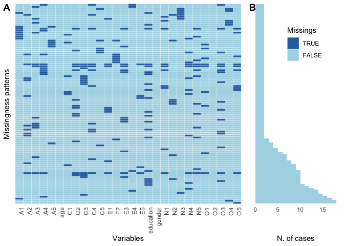

<!-- README.md is generated from README.Rmd. Please edit that file -->

# pmmisc

<!-- badges: start -->

[](https://www.tidyverse.org/lifecycle/#experimental)
[](https://CRAN.R-project.org/package=specr)
<!-- badges: end -->

This package includes some custom-made functions to facilitate some
common data wrangling procedures as well as common computations in
descriptive analyses. Please note that most functions are highly
costumized to my own workflow. They may hence break in more general
frameworks or when used in a different way…

## Dependencies

Most functions require the following packages:

  - For data wrangling procedure: `tidyverse` and `magrittr`
  - For printing and typesetting: `papaja`
  - For descriptive analyses: `psych`
  - For some plots: `gridExtra`

These packages should be installed prior to using this package.

## Installation

You can install the development version from
[GitHub](https://github.com/) with:

``` r
# install.packages("devtools")
devtools::install_github("masurp/pmmisc")
```

# Some usage examples

``` r
library(pmmisc)
library(dplyr)

# Get example data
d <- psych::bfi
```

## Simple data descriptions

``` r
# Describe numeric variables
d %>%
  select(A1:A5) %>%
  describe_vars(first_col = "items")
#> # A tibble: 5 x 7
#>   items  mean    sd   min   max   skew kurtosis
#>   <chr> <dbl> <dbl> <dbl> <dbl>  <dbl>    <dbl>
#> 1 A1     2.41  1.41     1     6  0.825  -0.308 
#> 2 A2     4.80  1.17     1     6 -1.12    1.05  
#> 3 A3     4.60  1.30     1     6 -0.998   0.442 
#> 4 A4     4.70  1.48     1     6 -1.03    0.0405
#> 5 A5     4.56  1.26     1     6 -0.847   0.159

# Describe factor variable
describe_factor(d$gender,
                name = "gender",
                useNA = "ifany")
#> # A tibble: 3 x 3
#>   gender     n percent
#>   <chr>  <int>   <dbl>
#> 1 1        919    32.8
#> 2 2       1881    67.2
#> 3 sum     2800   100
```

## Missing value analysis

``` r


# Count overall missings
count_na(d)
#> # A tibble: 3 x 3
#>   missings     n percent
#>   <chr>    <int>   <dbl>
#> 1 FALSE    77669  99.1  
#> 2 TRUE       731   0.932
#> 3 sum      78400 100

# Plot missingness patterns
missing_pattern_plot(d, var_labels = TRUE)
```


